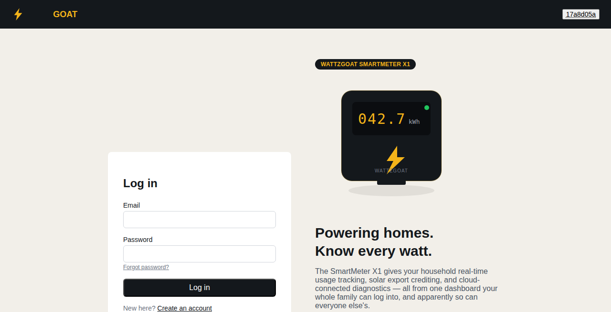
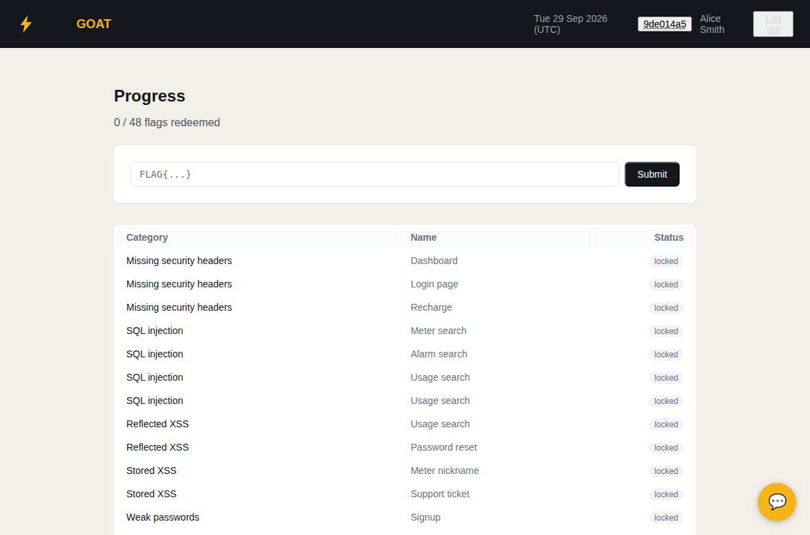
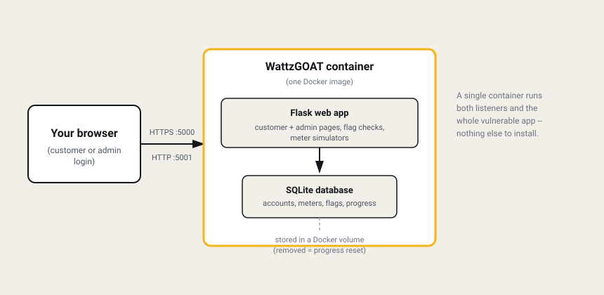

# WattzGOAT

WattzGOAT is an intentionally vulnerable web application built to be hacked. It is a made-up smart meter company with a customer portal, and it's a lab, not a real product. Customers can check their meter, top up their balance, report solar power, look at bills and contact support. Admins can manage meters and look after support tickets.

The site is vulnerable on purpose, so you can practise finding real security weaknesses in a safe place.



## Key features

- A full customer portal (signup, meter dashboard, recharge, solar export, bills, support tickets) plus an admin side, so there's a realistic amount of surface to explore, not just a single vulnerable form.
- 48 hidden weaknesses to find and exploit, from easy to hard.
- A capture-the-flag style Progress page that tracks which ones you've found.
- A simulated AI assistant with its own set of weaknesses to find.
- Runs as a single Docker container with no other setup. For groups, an optional instructor dashboard runs alongside it (see [Instructor mode](#instructor-mode)).

## How you learn with it

WattzGOAT works like a capture the flag (CTF) game. There are 48 flags hidden in the site. You get a flag by finding a weakness and using it. Five of the 48 are bonus flags about a simulated AI assistant.

The weaknesses are the kind of problems described in the OWASP Top 10, things like broken access control and injection, so what you practise here applies to real websites too.

To get started, create an account or log in with one of the sample customer accounts, then look around and try things out. When you find a flag, you can enter it on the Progress page, which keeps track of the ones you have found.



Sample customer accounts have emails like `alice.smith@example.com`. Their passwords are the first name followed by `123`.

## Quick start

If you already have Docker installed, this gets you running in one step. See "What you need" and "Start WattzGOAT" below for the full explanation.

```
docker run -d --name wattzgoat -p 5000:5000 -p 5001:5001 -e INSTANCE_HOST=127.0.0.1 -e STANDALONE=true -e STANDALONE_PASSWORD=YourPasswordHere ghcr.io/wattzgoat/wattzgoat-web:latest
```

Then open https://127.0.0.1:5000 in your browser.

## How it fits together

WattzGOAT runs as a single container: the web app and its database both live inside it, reachable over two ports (one HTTPS, one plain HTTP; a couple of the exercises specifically need the unencrypted one). Nothing else needs to be installed or run alongside it.



## Warning

**This site is insecure on purpose.**

- Run it only on your own computer, or on a private network that you control.
- Never put it on the internet.
- Never type real passwords or personal details into it.

All company names, accounts and data in the site are made up.

## Built with AI

This project was built with the help of AI tools and contains AI-written code. The weaknesses are there on purpose, but the code may also have other bugs or security problems that were not planned. Please keep this in mind and follow the warning above.

## What you need

- A computer running Windows, macOS or Linux.
- An internet connection for the first setup.
- **Docker**, to run the site. Follow the official install steps at https://docs.docker.com/get-started/get-docker/.
- **Git**, only if you want to build the site from the source code. Follow the official install steps at https://git-scm.com/downloads.

To check that Docker works, run these two commands. If the second one prints a "Hello from Docker!" message, you are ready.

```
docker --version
docker run --rm hello-world
```

## Start WattzGOAT

You can either use the ready-made image or build it yourself. Both give you the same site. Use the same commands on Linux, macOS and Windows (in PowerShell).

### Option 1: use the ready-made image

```
docker run -d --name wattzgoat -p 5000:5000 -p 5001:5001 -e INSTANCE_HOST=127.0.0.1 -e STANDALONE=true -e STANDALONE_PASSWORD=YourPasswordHere ghcr.io/wattzgoat/wattzgoat-web:latest
```

Docker downloads the image the first time you run this.

### Option 2: build it from the source code

```
git clone https://github.com/wattzgoat/wattzgoat-web.git
cd wattzgoat-web
docker build -t wattzgoat .
docker run -d --name wattzgoat -p 5000:5000 -p 5001:5001 -e INSTANCE_HOST=127.0.0.1 -e STANDALONE=true -e STANDALONE_PASSWORD=YourPasswordHere wattzgoat
```

The build downloads some packages, so it needs an internet connection and takes a few minutes.

### What the settings mean

| Setting | What it does |
| --- | --- |
| `-p 5000:5000` | Makes the site available on port 5000 (HTTPS). |
| `-p 5001:5001` | Makes the site also available on port 5001 (plain HTTP). Some exercises use it, so keep both ports. |
| `INSTANCE_HOST` | The IP address you will type into your browser. Use `127.0.0.1` if the browser is on the same computer. If you run WattzGOAT on another machine, use that machine's IP address, for example `192.168.1.50`. It must be an IP address, not a name. |
| `STANDALONE` | Set to `true` when you run a single copy on its own. |
| `STANDALONE_PASSWORD` | A password of your choice. Replace `YourPasswordHere` with your own. |

### Open the site

Go to https://127.0.0.1:5000 in your browser (or use the IP address you set in `INSTANCE_HOST`).

Your browser will warn you that the connection is not private. This is normal, because the site makes its own security certificate. Choose **Advanced**, then continue to the site.

## Instructor mode

Instructor mode adds a second site, the instructor dashboard, that runs next to the normal site and helps you run WattzGOAT with a group. You log in to it separately, with instructor accounts you create.

- **Vulnerability switches.** Turn any single vulnerability, or a whole group of them, from vulnerable to fixed and back while people watch. Showing the same page both ways is a good way to see what a fix really changes.
- **Participant leaderboard.** A live list of everyone taking part, ranked by flags found, with their latest activity. Select **View** to see which flags a person has found and which are left, in the same order as their Progress page. Select **Reset** at the end of a person's row to clear that person's progress without touching anyone else's.
- **Three ways to reset.**

| Reset | What it does |
| --- | --- |
| **Reset Lab** | Starts completely fresh. The site goes back to its original state, every switch returns to vulnerable, flag values change, and everyone's progress and nicknames are cleared. |
| **Reset App** | Restores the shop's own data (accounts, meters, tickets) and returns every switch to vulnerable, but keeps everyone's progress, nicknames and flag values. |
| **Reset All Redemptions** | Clears everyone's progress only. Nothing else changes. |

### Running a competition instead?

You can skip instructor mode. If you start a single copy as in the Quick start (with `STANDALONE=true` and your `STANDALONE_PASSWORD`), it includes a hidden page at https://127.0.0.1:5000/participants. Sign in with your `STANDALONE_PASSWORD` to get the same participant leaderboard described above.

### Before you start

- Everything in [What you need](#what-you-need) above.
- Two instructor accounts. Choose an email and a password for each. Instructor mode needs both.
- One Docker volume shared by the normal site and the dashboard, so the dashboard can see and control the site. Docker Compose creates it for you. With plain Docker commands you create it with one command.
- Leave out the `STANDALONE` settings from the Quick start. Instructor mode replaces them.

### Start with Docker Compose

1. Get the file `docker-compose.instructor.yml` from the main folder of the project. Clone the project as in "Option 2: build it from the source code" above, or download just that file from GitHub.
2. In the same folder, create a file named `.env` containing your instructor accounts:

   ```
   TRAINER1_EMAIL=instructor1@example.com
   TRAINER1_PASSWORD=YourPasswordHere
   TRAINER2_EMAIL=instructor2@example.com
   TRAINER2_PASSWORD=YourPasswordHere
   ```

   Replace the emails and passwords with your own, and avoid the `$` character in passwords. If your browser is on a different computer, also add `INSTANCE_HOST=192.168.1.50` (use the IP address of the machine running Docker). If you built the image from source, also add `WATTZGOAT_IMAGE=wattzgoat`.
3. Start both sites:

   ```
   docker compose -f docker-compose.instructor.yml up -d
   ```

To stop them, run `docker compose -f docker-compose.instructor.yml down`. Progress is kept. Add `-v` to the end of that command to delete it too.

### Start with Docker commands

Create the shared volume, then start the normal site **first**, then the dashboard. Replace the emails and passwords with your own.

```
docker volume create wattzgoat-data
docker run -d --name wattzgoat -p 5000:5000 -p 5001:5001 -e INSTANCE_HOST=127.0.0.1 -v wattzgoat-data:/app/data ghcr.io/wattzgoat/wattzgoat-web:latest
docker run -d --name wattzgoat-instructor -p 5004:5004 -e TRAINER_DASHBOARD=true -e INSTANCE_HOST=127.0.0.1 -e PARTICIPANT_BASE_URL=https://127.0.0.1:5000 -e TRAINER1_EMAIL=instructor1@example.com -e TRAINER1_PASSWORD=YourPasswordHere -e TRAINER2_EMAIL=instructor2@example.com -e TRAINER2_PASSWORD=YourPasswordHere -v wattzgoat-data:/app/data ghcr.io/wattzgoat/wattzgoat-web:latest
```

If the browser is on a different computer, use the IP address of the machine running Docker instead of `127.0.0.1`, in all three places. If you built the image from source, use `wattzgoat` instead of `ghcr.io/wattzgoat/wattzgoat-web:latest`.

### Open the dashboard

Go to https://127.0.0.1:5004 and log in with one of your instructor accounts. Everyone else uses the normal site at https://127.0.0.1:5000. Your browser will show the same security warning as before.

## Everyday commands

| What you want to do | Command |
| --- | --- |
| See that it is running | `docker ps` |
| Read the logs | `docker logs wattzgoat` |
| Stop it | `docker stop wattzgoat` |
| Start it again (keeps your progress) | `docker start wattzgoat` |
| Start again from scratch | `docker rm -f wattzgoat`, then run the start command again |

Removing the container clears everything, including the flags you have found.

**To update to a newer version**

Get the new version first, then replace the old container. Updating clears your progress, because the old container is removed.

- Ready-made image:
  1. `docker pull ghcr.io/wattzgoat/wattzgoat-web:latest`
  2. `docker rm -f wattzgoat`
  3. Run the start command again.
- Built from source:
  1. `git pull`
  2. `docker build -t wattzgoat .`
  3. `docker rm -f wattzgoat`
  4. Run the start command again.

## If something goes wrong

- **"Port is already allocated"**: another program is using that port. Change the number on the left of the port setting, for example `-p 8443:5000`, and open https://127.0.0.1:8443 instead.
- **The page does not load**: run `docker ps` to check the container is running. If it is not, run `docker logs wattzgoat` to see why.
- **The container stops right after starting**: check that `INSTANCE_HOST` is an IP address, such as `127.0.0.1`, and not a name like `localhost`.
- **On Windows or macOS, Docker commands fail**: make sure Docker Desktop is open and running.

## Contributing

Ideas and bug reports are welcome. Please open an issue on the [GitHub Issues page](https://github.com/wattzgoat/wattzgoat-web/issues).

If you would like to add or change something, you can send a pull request. Pull requests are reviewed before they are merged. For bigger changes, please open an issue first so we can talk about it.

The weaknesses in the site are there on purpose, so they are not bugs. Problems that stop the site from working, or weaknesses that were not planned, are worth reporting.

To run the automated tests, you need Python 3.12 and a fresh copy of the site running (see above):

```
pip install -r tests/requirements-dev.txt
pytest tests
```

Set `WATTZGOAT_BASE_URL` to the address of your copy if it is not `https://127.0.0.1:5000`. The tests change data in the site, so use a fresh copy each time.

## License

WattzGOAT is licensed under the MIT License. You are free to use, copy and change it. See the [LICENSE](LICENSE) file for the full terms.

Copyright 2026 WattzGOAT
